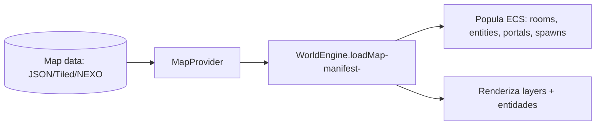
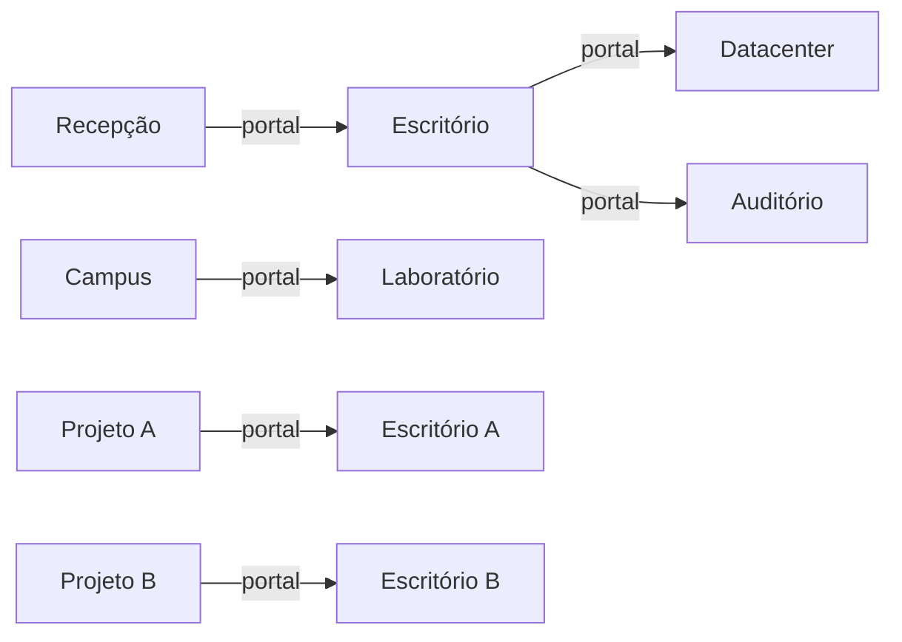
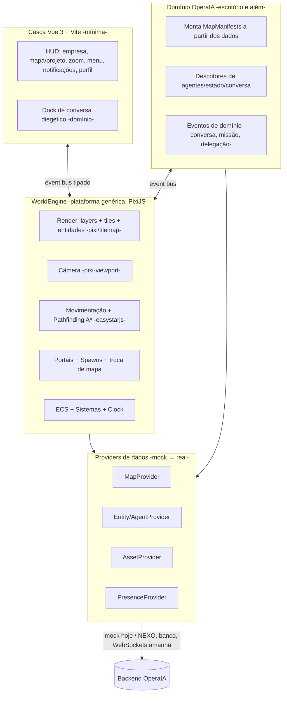

# OperaIA.lab — Plataforma de Mundo Virtual (WorldEngine)

> **Status:** conceito **APROVADO** e **Fase 0 concluída** (realinhamento
> genérico já implementado — ver §11 e §12). Diretriz arquitetural oficial do
> projeto. Nenhuma renderização/movimentação/asset/lógica de mundo foi
> implementada ainda: a Fase 0 valida apenas a **arquitetura definitiva**.
>
> **Diretriz conceitual:** a OperaIA.lab **não** é um "escritório isométrico".
> Ela é um **Mundo Virtual** — uma plataforma de ambientes. O **escritório
> corporativo é apenas o primeiro mapa** carregado por dados sobre a engine.

---

## 0. Resumo executivo

A OperaIA.lab passa a ser uma **plataforma de ambientes virtuais** dirigida por
dados. O componente central é a **`WorldEngine`**: um motor **genérico** que
carrega e renderiza **qualquer mapa** a partir de dados, sem conhecer regras de
negócio nem conceitos de "escritório".

O usuário possui um **avatar**, caminha por **mapas** conectados por **portais**,
encontra **entidades** (agentes, objetos, mobiliário) e interage com elas. O
**escritório corporativo** é o primeiro mapa; campus, laboratórios, datacenters,
auditórios, showrooms, salas de eventos e ambientes criados por clientes são
apenas **novos mapas/dados** — nenhum exige reescrever a engine.

Decisões técnicas mantidas das versões anteriores: **renderer PixiJS v8**
(`pixi-viewport`, `@pixi/tilemap`, `easystarjs`), **casca em Vue 3 + Vite**
(sem migração), **engine plugável via porta `WorldEngine`**, **tudo dirigido por
dados**. O que muda é o **escopo conceitual**: a engine é uma plataforma, não um
produto de escritório.

---

## 1. Mudança conceitual: de escritório para Mundo Virtual

Antes:

```text
OperaIA.lab = Escritório isométrico
```

Agora:

```text
OperaIA.lab = Mundo Virtual (plataforma)
                └── Mapa 1: Escritório Corporativo  (primeira experiência)
                └── Mapa 2..n: Campus, Lab, Datacenter, Auditório, ... (futuro)
                └── Mapas de Projeto: Escritório do Projeto A, B, ...
                └── Mapas de Cliente: ambientes criados pelos próprios clientes
```

Princípios que passam a orientar **toda** a arquitetura:

1. **Genérico por padrão** — a engine só conhece conceitos universais de mundo
   (mapa, sala, área, entidade, objeto, tile, camada, portal, spawn, câmera,
   animação, interação, estado, caminho, evento). Zero vocabulário de negócio.
2. **Orientado a dados** — nenhum mapa, posição, sala ou entidade é escrito em
   código. Tudo é descrito por dados carregados pela engine.
3. **Ambiente é conteúdo, não código** — adicionar um novo ambiente é adicionar
   **dados** (um novo mapa + entidades + assets), nunca refatorar a engine.
4. **Entidades independentes de ambiente** — a mesma entidade (avatar, porta,
   planta, monitor) funciona em qualquer mapa; cada mapa usa só as que precisa.
5. **Conexão por portais** — mapas se ligam por portais; a troca de mapa é
   transparente para o usuário (ele apenas atravessa).
6. **Escala sem reescrita** — múltiplos mapas, prédios, andares, usuários,
   empresas e projetos são casos de dados, não de arquitetura.

> Regra de ouro: **se algo é específico do escritório (uma sala "Jurídico", um
> estado "Programando", um cargo "CTO"), isso é DADO de um mapa/domínio — nunca
> um conceito da engine.**

---

## 2. Glossário genérico da engine

A `WorldEngine` conhece **apenas** estes conceitos (nada de "escritório"):

| Conceito | Definição genérica |
| --- | --- |
| **Map** | Um ambiente completo carregável (layout + camadas + entidades + portais + spawns + regras). |
| **Room** | Um recinto delimitado dentro de um mapa (paredes/limites). Sua "função" é um dado. |
| **Area** | Uma região lógica (pode agrupar salas ou marcar zonas: interação, foco, gatilho). |
| **Entity** | Tudo que existe no mundo = id + componentes. Sem herança/tipos fixos. |
| **Object / Prop** | Entidade de cenário (estática ou interativa) descrita por dados. |
| **Tile** | Célula da grade do mapa (piso/parede/decoração), vinda de um tileset. |
| **Layer** | Camada de render/lógica (piso, paredes, objetos, atores, overlay, colisão). |
| **Portal** | Ligação entre um ponto de um mapa e um `SpawnPoint` de outro mapa. |
| **SpawnPoint** | Ponto de entrada nomeado em um mapa (onde atores aparecem). |
| **Camera** | Visão do mundo (zoom, pan, foco, animação). |
| **Animation** | Clipe de animação de uma entidade (dado, não hardcoded). |
| **Interaction** | Capacidade de uma entidade ser alvo de ação (raio, tipo, rótulo). |
| **State** | Estado genérico de uma entidade (`current: string` + valores), dirigido por dados. |
| **Path** | Rota de navegação (resultado do pathfinding) para movimentação. |
| **Event** | Mensagem tipada no barramento (fatos do mundo), sem semântica de negócio. |

Qualquer significado de negócio ("sala da CEO", "monitor ligado", "agente
programando") é **projeção de dados** sobre esses conceitos.

---

## 3. Entidades independentes de ambiente

Uma **entidade** é apenas `id + componentes` (modelo ECS). Não há classes
"NPC"/"Mesa" na engine. Os "tipos" de entidade abaixo são **prefabs de dados**
(um `ref` + um conjunto de componentes), reutilizáveis em qualquer mapa:

| Prefab (dado) | Composto por (componentes genéricos) |
| --- | --- |
| **Avatar** (usuário) | transform · renderable · movable · presence(kind=user) · animation · state |
| **Agent** | transform · renderable · movable · presence(kind=agent) · interactable(agent) · animation · state |
| **NPC** | transform · renderable · movable · presence(kind=guest) · animation |
| **Door** | transform · renderable · portal · interactable(portal) |
| **Elevator** | transform · renderable · portal(multi-alvo) · interactable(portal) |
| **Table / Chair / Plant / Decoration** | transform · renderable · (interactable opcional) |
| **Computer / Monitor** | transform · renderable · state(on/off) · (interactable opcional) |
| **Vehicle** | transform · renderable · movable · state |
| **InteractiveObject** | transform · renderable · interactable · state |

> **Door e Elevator não são conceitos da engine** — são prefabs que usam o
> componente genérico **`portal`** + **`interactable`**. Assim "atravessar uma
> porta" e "pegar um elevador" são o mesmo mecanismo (portal), diferindo só nos
> dados (um alvo vs. vários alvos/andares).

Cada mapa **declara** quais prefabs instancia e onde — via dados, nunca em código.

---

## 4. Sistema de mapas (orientado a dados)

A engine carrega **qualquer mapa** a partir de um **manifesto de dados**. Nenhum
mapa é implementado em código.

Um mapa contém:

| Campo | Descrição |
| --- | --- |
| **id** | Identificador único do mapa. |
| **name** | Nome exibível. |
| **theme** | Identidade visual/tileset a usar (ex.: "corporate", "lab", "datacenter"). |
| **grid** | Tamanho do tile + dimensão da grade (cols/rows) por andar/nível. |
| **layout / layers** | Camadas de tiles (piso, paredes, objetos) — dados de tilemap. |
| **rooms / areas** | Recintos e regiões lógicas (limites + `kind` como string de dado + tags). |
| **entities** | Lista de blueprints (prefab `ref` + componentes) a instanciar. |
| **spawnPoints** | Pontos de entrada nomeados. |
| **portals** | Ligações para outros mapas (alvo = mapId + spawnPointId). |
| **rules** | Regras do mapa (grade de colisão/caminhável, raios padrão, etc.). |
| **ambient** *(futuro)* | Música ambiente e iluminação (campos reservados desde já). |



- **Fonte dos dados:** hoje objetos/JSON mock; amanhã Tiled (`.tmj`), banco ou
  NEXO — trocando apenas o `MapProvider`.
- **Regra:** `WorldEngine.loadMap(manifest)` funciona para **qualquer** mapa;
  não há ramificação por "tipo de ambiente".

---

## 5. Sistema de portais

Ambientes se conectam por **portais**. Um portal liga um ponto de um mapa a um
`SpawnPoint` de outro mapa (ou de outro andar/prédio do mesmo mapa).



- **Transparência:** o usuário apenas **atravessa** o portal (caminha até ele).
  A engine faz `descarrega mapa atual → carrega mapa alvo → posiciona no
  SpawnPoint → fade` de forma transparente.
- **Modos:** `walk` (atravessar caminhando, ex.: porta) ou `instant` (ex.:
  elevador/teleporte).
- **Genérico:** portal não sabe o que conecta; só conhece `{ target: mapId +
  spawnPointId, mode }`. Recepção→Escritório e Campus→Laboratório usam o mesmo
  mecanismo.

---

## 6. Ambientes futuros (todos são apenas dados)

A mesma engine suporta, **sem refatoração**, adicionando apenas mapas/dados:

Escritório Corporativo · Campus Empresarial · Laboratório de Pesquisa · Centro de
Operações · Datacenter · Auditório · Centro de Treinamento · Showroom · Sala de
Eventos · Espaço de Clientes · Escritório de Projetos · Ambientes temporários de
workshop · **Ambientes criados pelos próprios clientes**.

> Cada um é um `MapManifest` com seu `theme`, tiles, entidades e portais. O
> "editor de ambientes de cliente" (futuro) é, na prática, uma UI que **produz
> esse manifesto** — a engine não muda.

---

## 7. Primeiro mapa: Escritório Corporativo (conteúdo, não engine)

Todo o design de escritório das versões anteriores permanece válido — porém
reclassificado como **dados do primeiro mapa**, não como arquitetura da engine.

### 7.1 Experiência-alvo do primeiro mapa

- **Espacial e viva:** agentes trabalham/andam/se reúnem; ambiente 24h.
- **Exploratória:** caminhada + câmera; descoberta de salas e pessoas.
- **Contextual:** falar com o CTO é ir até a área de Tecnologia; entrar num
  projeto é atravessar um portal para o mapa daquele projeto.
- **Minimalista:** a tela é o mundo; a UI é reduzida ao essencial.

### 7.2 Identidade visual (original — direção aprovada)

- Isométrico 2:1; corporativo **moderno, premium**, IA/laboratório de inovação.
- **Neutros** (grafite, off-white) com **azul e roxo** (marca OperaIA); luz
  difusa premium.
- Personagens **estilizados, não infantis**; **sem semelhança com Habbo**;
  **todos os assets autorais**.

### 7.3 Salas do primeiro mapa (dados)

Ambientes do escritório (Recepção, Sala da CEO, Reuniões, Centro de Operações,
Produto, UX Research, UI Design, Tecnologia, Automação, Datacenter, Laboratório
IA, Marketing, Comercial, Financeiro, Jurídico, RH, Biblioteca) — cada um é uma
**`room` do mapa** com `kind` (string de dado), limites, tags e blueprints de
decoração. **A engine não conhece "Jurídico"**; ela conhece uma `room` com
`kind: "legal"` definido no dado do mapa.

### 7.4 Agentes do primeiro mapa (dados de domínio)

Papéis (CEO, CTO, PM, UX/UI, Dev, DevOps, Marketing, etc.) e seus **estados**
("Trabalhando", "Programando", "Pesquisando", "Em reunião", "Analisando dados"…)
são **dados do domínio OperaIA**, projetados sobre o componente genérico `state`
(um `current: string`). A engine anima conforme o `state`, sem saber o que
"Programando" significa.

### 7.5 Conversas (domínio, disparadas por eventos da engine)

Aproximar-se de um agente gera o evento genérico `entity:interacted`; a **camada
de domínio** (não a engine) abre a conversa contextual (diegética, dock compacto),
mantém histórico/memória por agente e reflete a ação de volta no mundo emitindo
mudanças de `state`.

---

## 8. Sistema de projetos (projeto = mapa(s))

- Cada **projeto** possui seu próprio **escritório** — que internamente é apenas
  **um mapa** do Mundo Virtual.
- Um projeto pode, no futuro, ter **vários mapas** (ex.: escritório + sala de
  reunião do cliente + showroom), conectados por portais.
- **Entrar no projeto** = atravessar um portal para o mapa do projeto (equipe,
  memória, histórico e contexto próprios daquele escopo de dados).
- **Isolamento por escopo de dados:** cada mapa de projeto tem seu conjunto de
  entidades/estado, servido pelos providers com o escopo `{empresa, projeto}`.

---

## 9. Escalabilidade

A arquitetura nasce preparada, **sem reescrever a engine**, para:

| Dimensão | Como escala (por dados) |
| --- | --- |
| **Múltiplos mapas** | Cada ambiente é um `MapManifest`; carregados sob demanda. |
| **Múltiplos prédios/andares** | Prédios/andares = mapas ligados por portais (elevador/escada). |
| **Múltiplos usuários** | Modelo de **presença** multiplayer-ready (vários atores por mapa). |
| **Múltiplas empresas** | Escopo raiz `empresa` seleciona o catálogo de mapas/dados. |
| **Múltiplos projetos** | Cada projeto = escopo de dados + seu(s) mapa(s). |
| **Milhares de objetos** | ECS + `@pixi/tilemap` + culling/pooling/LOD. |

---

## 10. Arquitetura técnica

### 10.1 Camadas (separação estrita)



- A **engine** é genérica e substituível (porta `WorldEngine`); só conhece
  conceitos do §2.
- O **domínio OperaIA** (escritório) vive **fora** da engine: ele produz mapas
  (dados) e traduz conceitos de negócio em entidades/estados genéricos.
- A **casca** só conhece a engine (via wrapper Vue) e o domínio (via providers).

### 10.2 Motor de render: PixiJS v8 (decisão mantida)

Mantida a decisão técnica anterior: **PixiJS v8** + `pixi-viewport` (câmera) +
`@pixi/tilemap` (camadas de tiles) + `easystarjs` (A*). Justificativa: melhor
performance/memória para milhares de objetos, montagem como **módulo
independente** (não toma posse do app), acoplamento mínimo com a casca. Phaser,
Three.js e Canvas 2D permanecem descartados pelos motivos já documentados.

### 10.3 Casca de UI (decisão mantida)

**Vue 3 + Vite**, sem migração. O mundo é um **módulo independente** integrado
por um wrapper Vue fino. Engine gráfica **plugável** pela porta `WorldEngine`.

### 10.4 Contratos genéricos da engine

- **Componentes (ECS):** `transform`, `renderable`, `movable`, `interactable`,
  `area`, `portal`, `state`, `animation`, `presence`. (Sem
  `agent`/`door`/`device`/`elevator` como componentes — viram prefabs de dados
  sobre os genéricos. `path` vive dentro de `movable`; `spawnPoint` é dado do
  mapa, não componente.)
- **Eventos genéricos (bus):** `world:ready`, `world:disposed`, `map:loaded`,
  `map:changed`, `clock:tick`, `camera:moved`, `tile:clicked`, `actor:moved`,
  `actor:entered-area`, `portal:entered`, `entity:selected`,
  `entity:interacted`, `entity:state-changed`, `entity:spawned`,
  `entity:removed`, `presence:joined`, `presence:left`.
- **Eventos de domínio:** `conversation:started`, `mission:created`,
  `project:selected`, etc. — vivem em um **mapa de eventos de domínio** separado
  (camada OperaIA), fora da engine.
- **Providers da engine:** `MapProvider`, `EntityProvider` (atores/entidades
  genéricos), `AssetProvider`, `PresenceProvider`, agregados em
  `WorldDataProvider`.
- **Providers de domínio (`office-domain`):** implementam as mesmas portas
  (`OfficeMapProvider`, `OfficeEntityProvider`, `OfficeAssetProvider`),
  traduzindo papéis/estados/conversa dos agentes em atores/estados genéricos.

### 10.5 Pipeline de arte e mapas

- **Tiled** exportando `.tmj` → `@pixi/tilemap`. **Texture atlases** para
  sprites. **Spec de arte original** por `theme` (corporate, lab, datacenter…).
- Cada `theme` é um conjunto de assets; mapas referenciam um `theme`.

### 10.6 Preparação de dados (mock → real)

`MapProvider`/`EntityProvider`/`AssetProvider`/`PresenceProvider` com interfaces
estáveis. Ligar banco, NEXO, memória, automações, WebSockets, multiempresa e
multiprojeto = **trocar implementação de provider**, sem tocar engine/casca.

---

## 11. Realinhamento da Fase 0 — CONCLUÍDO

O módulo `office-world` foi **renomeado para `virtual-world`** e todos os
conceitos de escritório que vazavam na engine foram **removidos** e movidos para
uma nova camada de domínio `office-domain` (escritório = dados). Realizado:

| Antes (office-centric) | Agora (genérico) — implementado |
| --- | --- |
| Módulo `modules/office-world` + wrapper `<OfficeWorld>` | `modules/virtual-world` + wrapper `<VirtualWorld>` (renderiza um mapa; escritório é um mapa) |
| Componente `AgentComponent` | Removido da engine → prefab `agent` = `presence` + `state` + `interactable` |
| Componentes `DoorComponent` + `ElevatorComponent` | Unificados no componente genérico `portal` (+ `interactable`) |
| `DeviceComponent` (monitor on/off) | Componente genérico `state` (`current`/valores) |
| `RoomComponent` com `RoomKind` (união "reception/executive/…") | `area` genérico com `kind: string` (dado) |
| `AgentStateId` (`WORKING/CODING/…`) no core | Movido ao **domínio** (`office-actors`); engine usa `state.current: string` |
| Eventos `agent:selected`, `avatar:entered-room`, `room:expanded` | Genéricos: `entity:selected`, `actor:entered-area`, `map:changed` + `portal:entered` |
| `AgentProvider`/`AgentDescriptor` no módulo do mundo | `EntityProvider`/`ActorDescriptor` genéricos na engine; escritório implementa via `office-domain` |
| Seed `providers/mock/data/hq-map.ts` (escritório embutido) | Virou **dado de domínio** (`office-domain/data/office-map.ts`), 1º mapa, consumido via `MapProvider` |

O que **permaneceu** (já estava genérico e correto): a porta `WorldEngine`, o
`EventBus` tipado, o ECS (`EntityWorld`/`EcsWorld`), o `WorldClock`, a
`CameraController`, o `StateStore`, o `SystemScheduler`, o `WorldRuntime` e o
`map-loader` (dados → ECS).

### 11.1 Estrutura definitiva de pastas

```text
apps/web/src/modules/
├── virtual-world/                 # ENGINE genérica (nenhum conceito de negócio)
│   ├── contracts/                 # Portas/interfaces (só tipos)
│   │   ├── ids.ts                 # EntityId, TileCoord, GridSize, TileRect, WorldPoint...
│   │   ├── components.ts          # transform, renderable, movable, interactable, area,
│   │   │                          #   portal, state, animation, presence
│   │   ├── entities.ts            # ComponentTypeMap + EntityWorld (ECS)
│   │   ├── systems.ts             # System, SystemContext, SystemScheduler
│   │   ├── events.ts              # EventBus + WorldEventMap (eventos genéricos)
│   │   ├── clock.ts               # WorldClock / WorldTime
│   │   ├── camera.ts              # CameraController / CameraDirector
│   │   ├── map.ts                 # MapManifest, FloorDef, AreaBlueprint, EntityBlueprint...
│   │   ├── assets.ts              # AssetManifest / AssetProvider (por theme)
│   │   ├── presence.ts            # PresenceActor / PresenceProvider (multiplayer-ready)
│   │   ├── providers.ts           # MapProvider, EntityProvider, WorldDataProvider
│   │   ├── state.ts               # WorldViewState / StateStore (por scopeId)
│   │   ├── world-engine.ts        # PORTA do renderer (substituível)
│   │   └── world-runtime.ts       # WorldRuntime (composition root)
│   ├── core/                      # Implementações agnósticas de framework
│   │   ├── event-bus.ts           # TypedEventBus
│   │   ├── ecs/ecs-world.ts       # EcsWorld
│   │   ├── ecs/system-scheduler.ts
│   │   ├── clock/simulation-clock.ts
│   │   ├── camera/logical-camera.ts
│   │   ├── state/state-store.ts   # Memory + LocalStorage
│   │   ├── map-loader.ts          # dados (MapManifest) → entidades (ECS)
│   │   └── create-world-runtime.ts# monta bus+ECS+clock+camera+scheduler+engine
│   ├── engines/
│   │   ├── null-world-engine.ts   # no-op (Fase 0); PixiWorldEngine chega na Fase 1
│   │   └── engine-factory.ts      # "null" | "pixi"
│   ├── providers/
│   │   ├── mock/                  # mapa "sandbox" genérico (prova de generalidade)
│   │   │   ├── data/sample-map.ts, data/sample-theme.ts
│   │   │   ├── mock-map-provider.ts, mock-entity-provider.ts
│   │   │   ├── mock-asset-provider.ts, mock-presence-provider.ts
│   │   │   └── mock-world-data-provider.ts
│   │   └── provider-factory.ts    # "mock" | "nexo" | "http"
│   ├── config/world-config.ts     # scope/map/engine default, clockScale...
│   └── vue/VirtualWorld.vue       # casca Vue desacoplada (<VirtualWorld />)
│
└── office-domain/                 # DOMÍNIO: o escritório como DADOS
    ├── data/office-map.ts         # 1º mapa (MapManifest genérico) — a "Sede"
    ├── data/corporate-theme.ts    # tema visual (AssetManifest)
    ├── data/office-actors.ts      # agentes como ActorDescriptor genérico
    ├── office-map-provider.ts     # implementa MapProvider (catálogo de mapas)
    ├── office-entity-provider.ts  # implementa EntityProvider (atores)
    ├── office-asset-provider.ts   # implementa AssetProvider (theme)
    └── office-world-data-provider.ts # compõe tudo → WorldDataProvider injetável
```

**Regra de dependência:** `office-domain` → depende de → `virtual-world`
(nunca o inverso). A engine não importa nada do domínio.

### 11.2 Como o escritório entra em cena (dados, não código)

A casca injeta o provider de domínio no wrapper genérico:

```vue
<VirtualWorld :provider="createOfficeWorldProvider()" map-id="office" scope-id="operaia" />
```

O `WorldRuntime` pede o mapa `"office"` ao `MapProvider`, o `map-loader`
transforma o `MapManifest` em entidades no ECS e o `WorldEngine` (hoje `null`,
amanhã `pixi`) recebe o mesmo manifesto. Trocar de ambiente = trocar `map-id`
(ou atravessar um `portal`); trocar fonte de dados = trocar provider.

---

## 12. Plano de implementação por fases (revisado)

> Fase 0/0.1 concluídas. A Fase 1 começa a partir daqui.

- **Fase 0.1 — Realinhamento genérico (só contratos, sem render) — ✅ CONCLUÍDA**
  - Módulo renomeado para `virtual-world`; componentes/eventos/providers
    genéricos (§11); escritório movido para `office-domain` (dados).
  - *Aceite atingido:* engine sem vocabulário de negócio; `typecheck` limpo;
    **43 testes verdes** (12 novos em `virtual-world.test.ts`), incluindo o
    escritório carregado como 1º mapa por uma engine 100% genérica.

- **Fase 1 — Primeiro mapa navegável (PixiWorldEngine)**
  - Implementar o `PixiWorldEngine` (porta `WorldEngine`): render de tiles/
    camadas, câmera (zoom/pan/follow), avatar, **click-to-walk + A***, colisão,
    **portais/spawns**. Carregar o **escritório como primeiro mapa (dados)** com:
    Recepção, Corredor, Sala da CEO, Tecnologia, Produto, Design, Marketing.
  - NPCs parados + conversa básica (via evento genérico → domínio).
  - *Aceite:* atravessar a recepção e as salas por caminhada, com zoom/colisão, e
    trocar de área por portal — **tudo carregado por dados**.

- **Fase 2 — Escritório completo (mais dados)** — os 17 ambientes como dados do
  primeiro mapa; decoração/identidade por `theme`.

- **Fase 3 — Entidades vivas** — sistemas de animação por `state`; agentes se
  movem/trabalham; ambiente vivo.

- **Fase 4 — Conversas contextuais (domínio)** — interação por aproximação;
  histórico/memória por agente; ação reflete no mundo.

- **Fase 5 — Projetos como mapas** — portal para o mapa do projeto; escopo de
  dados isolado; base para múltiplos mapas por projeto.

- **Fase 6 — Multi-mapa e expansão** — segundo `theme`/ambiente (ex.: Datacenter
  ou Campus) provando a generalidade; prédios/andares por portais.

- **Fase 7 — Dados ao vivo + HUD + polish** — WebSockets/real; presença
  multiusuário; HUD mínimo; performance (60fps com carga alvo).

---

## 13. Riscos e mitigação

| Risco | Mitigação |
| --- | --- |
| Vazamento de conceitos de negócio na engine | Glossário genérico (§2) + revisão de contratos; domínio separado |
| Acoplamento à engine gráfica | Porta `WorldEngine`; PixiJS substituível sem tocar na casca |
| Complexidade de portais/troca de mapa | Mecanismo único (portal → mapId+spawn); carga sob demanda |
| Custo de arte por `theme` | Kits de tiles/prefabs reutilizáveis; começar por 1 theme |
| Escopo grande | Entrega faseada com aceite por fase |

---

## 14. Decisões e pendências

**Confirmado (mantido):** PixiJS v8; Vue 3 + Vite (sem migração); engine plugável;
tudo orientado a dados; identidade visual premium original; providers mock →
real.

**Aprovado (diretriz oficial):**

1. **Conceito de plataforma de Mundo Virtual** (engine genérica; escritório = 1º
   mapa carregado por dados).
2. **Realinhamento da Fase 0** (§11): `office-world → virtual-world`,
   componentes/eventos/providers genéricos, escritório movido para `office-domain`.

> Fase 0 concluída e validada. Próximo passo: **Fase 1** — `PixiWorldEngine`
> (implementando a porta `WorldEngine`) renderizando o escritório como primeiro
> mapa por dados, com câmera, click-to-walk (A*), colisão e portais.
